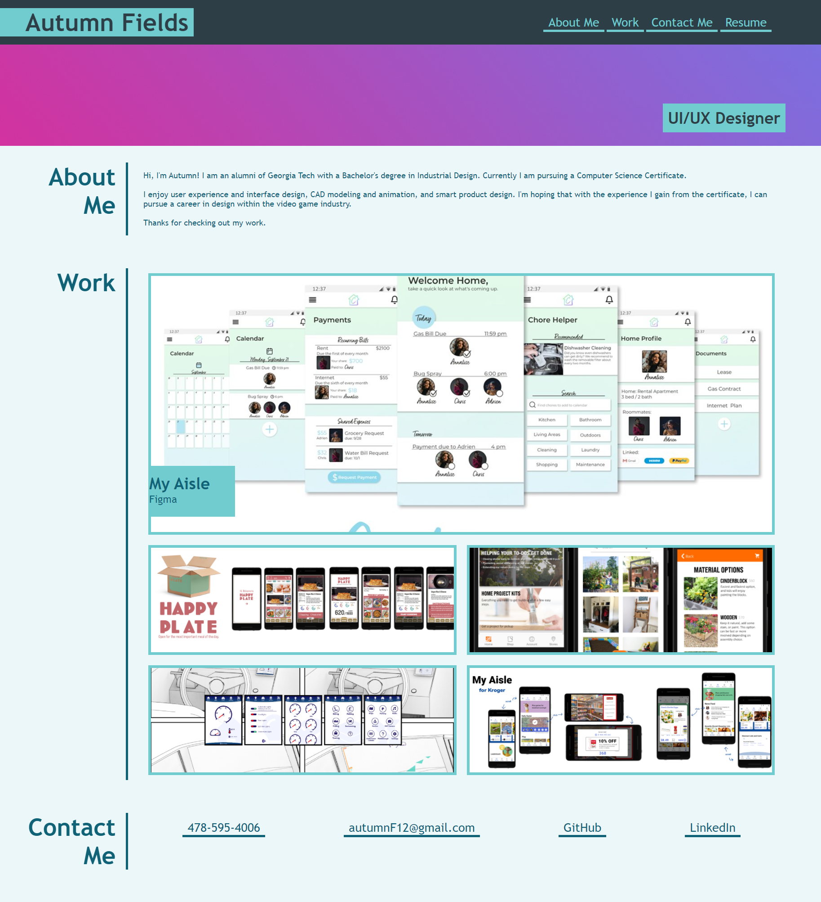
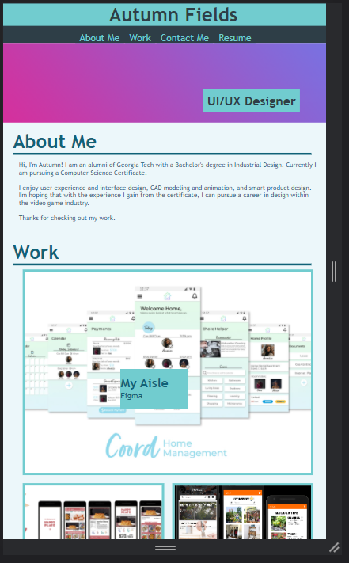
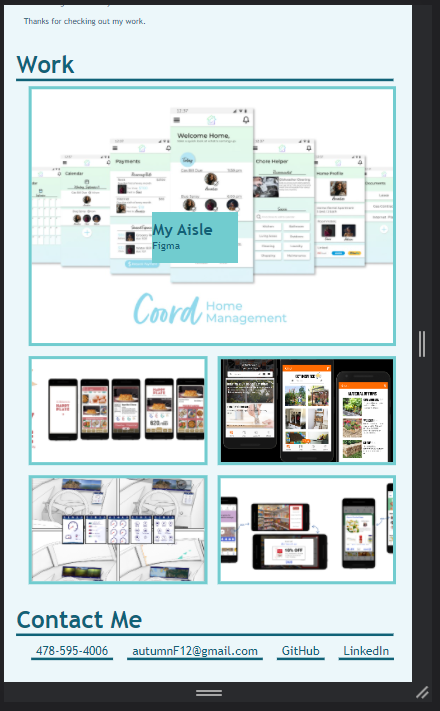
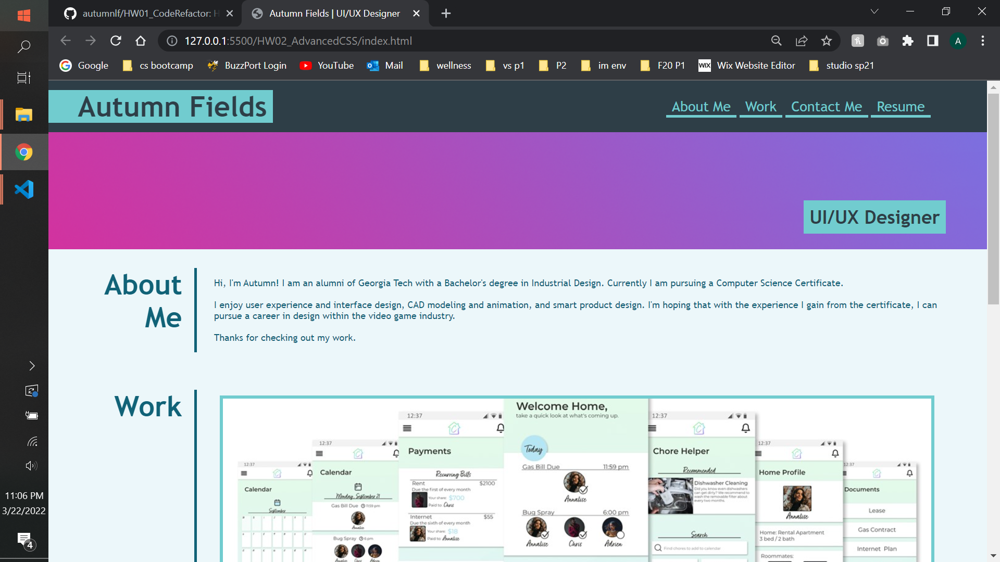

# Portfolio Site

**Link to deployed application:**
>https://autumnlf.github.io/HW02_AdvancedCSS/

## Description
In this homework assignment, I was tasked with recreating a given portfolio site without any starter code. 
*   Site to recreate:
    
    

*update: given the assignment to update the site after a big project

## Screenshots:

